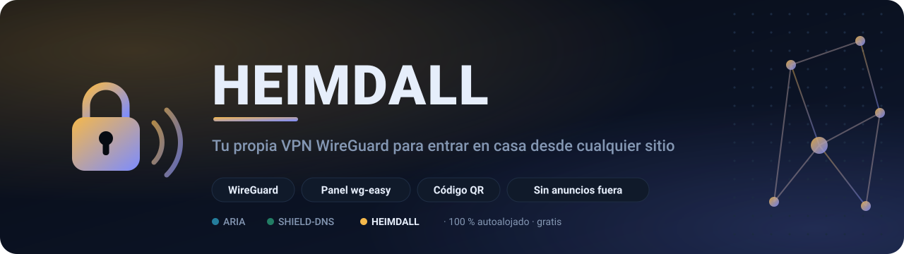
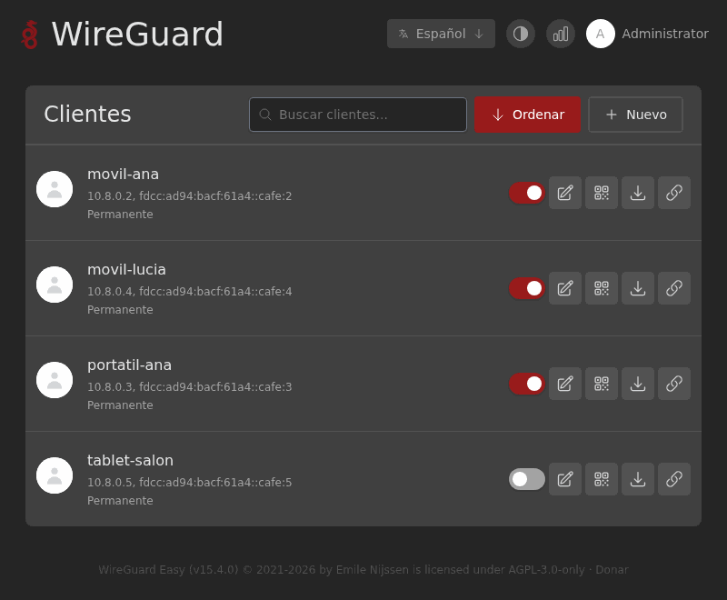
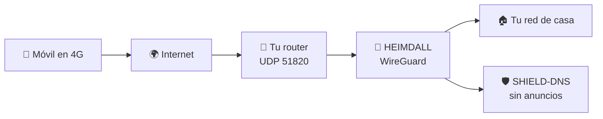
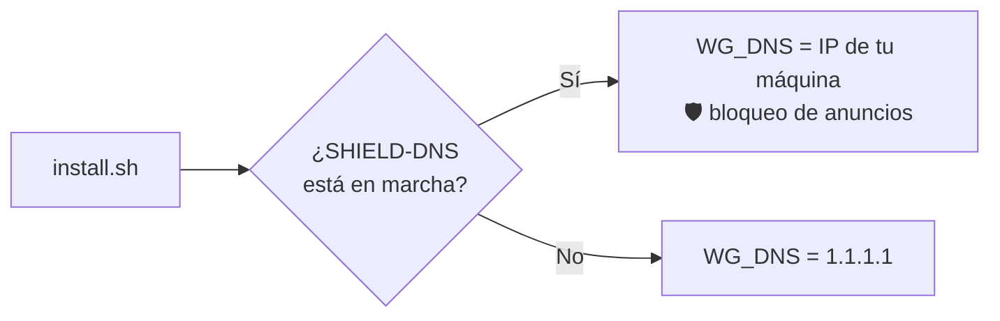
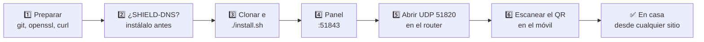
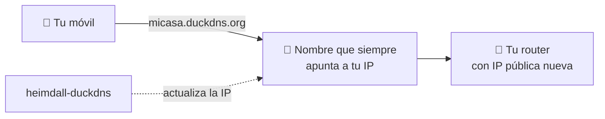
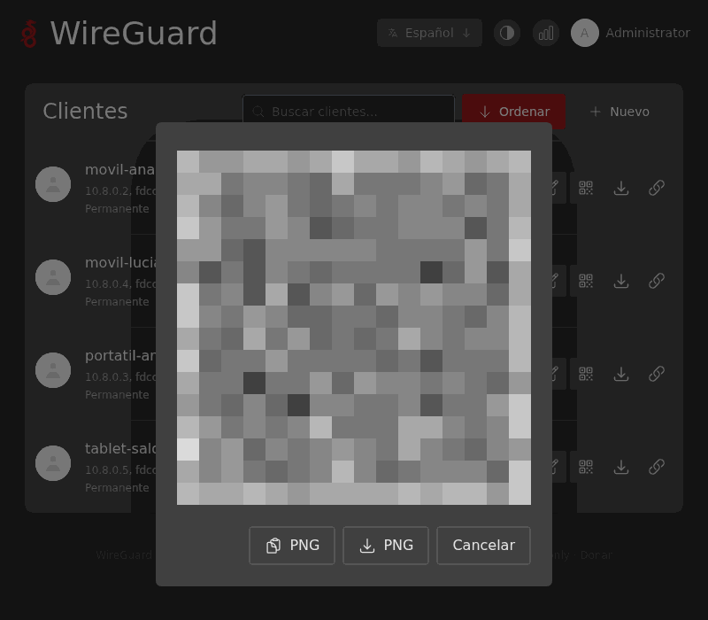
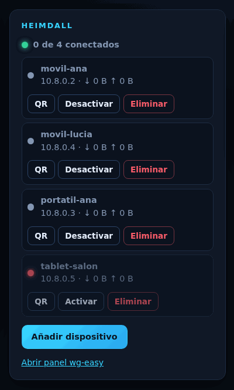

<a name="readme-top"></a>

<p align="center">
  <sub>Parte del ecosistema ARIA&nbsp;&nbsp;·&nbsp;&nbsp;<a href="https://github.com/BertMarti/ARIA">🤖 ARIA</a>&nbsp;&nbsp;·&nbsp;&nbsp;<a href="https://github.com/BertMarti/SHIELD-DNS">🛡️ SHIELD-DNS</a>&nbsp;&nbsp;·&nbsp;&nbsp;<b>🔐 HEIMDALL</b></sub>
</p>

<p align="center">
  <picture>
    <source media="(prefers-color-scheme: dark)" srcset="docs/img/banner-oscuro.svg">
    <source media="(prefers-color-scheme: light)" srcset="docs/img/banner-claro.svg">
    
  </picture>
</p>

<p align="center">
  <a href="LICENSE"></a>
  
  
  
  
  
  
  
  
  
</p>

<p align="center">
  <b><a href="#-instalación">🚀 Instalar</a></b>&nbsp;&nbsp;·&nbsp;&nbsp;
  <a href="#-abre-el-puerto-en-el-router">🚪 Abrir el puerto</a>&nbsp;&nbsp;·&nbsp;&nbsp;
  <a href="#-uso-diario">📱 Añadir un móvil</a>&nbsp;&nbsp;·&nbsp;&nbsp;
  <a href="#-problemas-frecuentes">🆘 Problemas</a>
</p>

**Tu propia VPN para entrar en casa desde cualquier sitio.** HEIMDALL convierte una Raspberry Pi o un PC con Linux en un servidor [WireGuard](https://www.wireguard.com) con un panel web sencillo para añadir dispositivos con un código QR.

Con la VPN conectada, tu móvil o portátil se comporta como si estuviera en casa: puedes abrir tus aplicaciones de casa, usar tu conexión en una Wi-Fi pública con más seguridad y, si tienes [SHIELD-DNS](https://github.com/BertMarti/SHIELD-DNS), llevarte el bloqueo de anuncios a todas partes.

Funciona solo o como aplicación integrada en [ARIA](https://github.com/BertMarti/ARIA), el asistente de IA que gestiona tus aplicaciones de casa.

<p align="center">
  
  <br><sub>Panel de HEIMDALL (wg-easy) en una instancia de demostración con dispositivos ficticios.</sub>
</p>

> [!NOTE]
> En los ejemplos, `192.168.1.50` es la máquina donde instalas HEIMDALL, `192.168.1.1` tu router y `tu-dominio.com` un dominio tuyo (opcional). Cámbialos por los tuyos.

## 📑 Índice

- [🔍 Cómo funciona](#-cómo-funciona)
- [✨ Qué incluye](#-qué-incluye)
- [📋 Requisitos](#-requisitos)
- [🚀 Instalación](#-instalación)
- [🚪 Abre el puerto en el router](#-abre-el-puerto-en-el-router)
- [⚙️ Configuración](#️-configuración)
- [🌍 Si tu IP pública cambia (DNS dinámico)](#-si-tu-ip-pública-cambia-dns-dinámico)
- [📱 Uso diario](#-uso-diario)
- [🤖 Con ARIA](#-con-aria)
- [💾 Copias, restauración y actualización](#-copias-restauración-y-actualización)
- [🗑️ Desinstalar](#️-desinstalar)
- [🆘 Problemas frecuentes](#-problemas-frecuentes)
- [⚠️ Limitaciones](#️-limitaciones)
- [🔌 Puertos y contenedores](#-puertos-y-contenedores)
- [🌐 El ecosistema ARIA](#-el-ecosistema-aria)
- [📄 Licencia](#-licencia)

## 🔍 Cómo funciona



<details>
<summary>Si tu visor no muestra el diagrama, aquí está en texto</summary>

```
 Móvil en 4G ──► internet ──► tu router (UDP 51820) ──► HEIMDALL ──► tu red de casa
                                                             └──► SHIELD-DNS (sin anuncios)
```

</details>

**¿Qué DNS usan los dispositivos conectados?** `install.sh` lo decide la primera vez:



## ✨ Qué incluye

| | Pieza | Qué hace |
|:---:|---|---|
| 🔐 | **[wg-easy](https://github.com/wg-easy/wg-easy) v15** | Servidor WireGuard con panel web para crear, activar, desactivar y borrar dispositivos, con QR y archivo `.conf` |
| 🔒 | **Caddy** | Sirve el panel por HTTPS (`https://192.168.1.50:51843`) con un certificado propio |
| 🦆 | **DuckDNS** (opcional) | Mantiene un nombre gratuito apuntando a tu IP pública si cambia |
| 🛡️ | **DNS de la VPN** | Si SHIELD-DNS está instalado, los dispositivos conectados lo usan y bloquean anuncios; si no, usan `1.1.1.1` |
| ⚡ | **Un comando para todo** | Instalación, actualización, copia y restauración |

<p align="right"><a href="#readme-top">⬆️ Volver arriba</a></p>

## 📋 Requisitos

| | Necesitas |
|---|---|
| 🖥️ Máquina | Raspberry Pi 4/5 con Raspberry Pi OS de 64 bits, o un PC/mini-PC con Debian, Ubuntu u otra distribución Linux con soporte de WireGuard en el kernel (lo traen todos los actuales). |
| 🐳 Software | Docker con `docker compose` v2. Si falta, el instalador lo instala con el script oficial. |
| 📍 IP fija | Una **IP fija** para la máquina dentro de casa (resérvala en el DHCP del router). |
| 📶 Router | Acceso al **router** para abrir un puerto (UDP 51820). |
| 🌍 IP pública | Una **IP pública** en tu conexión. Si tu operador usa CG-NAT, no podrás recibir conexiones (ver [problemas frecuentes](#-problemas-frecuentes)). |

> [!WARNING]
> **Windows**: no soportado. WireGuard dentro de WSL2/Docker Desktop no recibe conexiones de fuera de forma fiable.

## 🚀 Instalación



**1. Prepara la máquina**:

```bash
sudo apt update && sudo apt install -y git openssl curl
```

**2.** Si también quieres SHIELD-DNS, **instálalo antes** que HEIMDALL: así la VPN lo usa como DNS automáticamente.

**3. Clona e instala**:

```bash
mkdir -p ~/homelab && cd ~/homelab
git clone https://github.com/BertMarti/HEIMDALL.git
cd HEIMDALL
./install.sh
```

**4.** Al terminar verás la dirección del panel, el usuario y dónde está la contraseña.

> ✅ **Comprobación:** `docker compose ps` muestra `heimdall-wg` y `heimdall-caddy` en marcha.

> [!TIP]
> ¿Quieres también ARIA y el bloqueador? Instala las tres aplicaciones de una vez, en el orden correcto, con el [instalador de ARIA](https://github.com/BertMarti/ARIA#-inicio-rápido-5-minutos):
>
> ```bash
> curl -fsSL https://raw.githubusercontent.com/BertMarti/ARIA/main/instalar-todo.sh | bash
> ```

<details>
<summary><b>🔧 Qué hace <code>install.sh</code></b></summary>
<br>

1. Instala Docker si no lo tienes y carga el módulo `wireguard` del kernel (si ya está integrado, solo avisa).
2. Crea `.env` y rellena lo que falte:
   - `LAN_IP` y `PI_HOSTNAME`: la IP y el nombre de la máquina.
   - `WG_ADMIN_PASSWORD`: una contraseña aleatoria para el panel.
   - `WG_HOST`: tu subdominio de DuckDNS (si lo configuraste) o tu IP pública actual.
   - `WG_DNS`: la IP de la máquina si SHIELD-DNS está en marcha; si no, `1.1.1.1`.
3. Arranca los contenedores (y DuckDNS, si lo configuraste) y espera a que el panel responda.
4. Muestra la dirección del panel, el servidor y el recordatorio de abrir el puerto.

</details>

> [!IMPORTANT]
> Puedes repetir `./install.sh` cuando quieras, pero `WG_ADMIN_USER`, `WG_ADMIN_PASSWORD`, `WG_HOST`, `WG_PORT` y `WG_DNS` solo se aplican la **primera vez** que arranca. Después se cambian desde el panel web.

### Primer acceso al panel

1. Desde un dispositivo de casa, abre `https://192.168.1.50:51843` (o `https://<nombre-de-la-máquina>.local:51843`).
2. El navegador avisará del certificado: es propio. Pulsa **Avanzado → Continuar**.
3. Usuario: `admin` (o el de `WG_ADMIN_USER`). Contraseña:
   ```bash
   grep WG_ADMIN_PASSWORD ~/homelab/HEIMDALL/.env
   ```

> ✅ **Comprobación:** ves la lista de clientes (vacía la primera vez) y el botón **Nuevo**.

<p align="right"><a href="#readme-top">⬆️ Volver arriba</a></p>

## 🚪 Abre el puerto en el router

Sin este paso la VPN solo funciona dentro de tu propia Wi-Fi, que no sirve de mucho. Cada router es distinto, pero los pasos son parecidos:

1. Entra en el router desde el navegador: normalmente `http://192.168.1.1` (mira la pegatina del router).
2. Busca **Reenvío de puertos**, **Port forwarding**, **NAT**, **Servidor virtual** o **Aplicaciones**.
3. Crea una regla:

   | Campo | Valor |
   |---|---|
   | Protocolo | **UDP** |
   | Puerto externo | **51820** |
   | IP interna | **192.168.1.50** |
   | Puerto interno | **51820** |

4. Guarda (algunos routers piden reiniciar).

> [!CAUTION]
> Es el **único** puerto que hay que abrir. El panel (51843) **no** se abre a internet: adminístralo desde casa, desde la propia VPN o, si usas ARIA con Cloudflare, por `https://heimdall.tu-dominio.com`.

> ✅ **Comprobación:** con el móvil en datos (no en tu Wi-Fi) y el túnel activo, la app WireGuard muestra un «último *handshake*» reciente.

## ⚙️ Configuración

Todo está en `.env` (se crea a partir de [`.env.example`](.env.example)).

| Variable | Por defecto | Para qué |
|---|---|---|
| `TZ` | `Europe/Madrid` | Zona horaria |
| `WG_ADMIN_USER` | `admin` | Usuario del panel (solo primer arranque) |
| `WG_ADMIN_PASSWORD` | aleatoria (la genera `install.sh`) | Contraseña del panel (solo primer arranque) |
| `WG_HOST` | tu subdominio DuckDNS o tu IP pública | Dirección a la que se conectan los dispositivos (solo primer arranque) |
| `WG_PORT` | `51820` | Puerto UDP de WireGuard (solo primer arranque) |
| `WG_DNS` | IP de la máquina si hay SHIELD-DNS; si no, `1.1.1.1` | DNS de los dispositivos conectados (solo primer arranque) |
| `WEB_PORT` | `51843` | Puerto del panel HTTPS |
| `LAN_IP`, `PI_HOSTNAME` | los detecta `install.sh` | Nombres con los que se sirve el panel |
| `DUCKDNS_SUBDOMAIN`, `DUCKDNS_TOKEN` | vacías | DNS dinámico gratuito (opcional) |

Para cambiar algo marcado como «solo primer arranque» cuando ya está funcionando, usa el panel web (apartado de administración). La otra opción es empezar de cero (`./uninstall.sh --purge` y `./install.sh`), pero **todos los dispositivos tendrían que volver a escanear su QR**.

## 🌍 Si tu IP pública cambia (DNS dinámico)

Muchas conexiones domésticas cambian de IP pública de vez en cuando. Si `WG_HOST` es una IP y cambia, tus dispositivos dejarán de conectar. La solución es usar un **nombre** que siempre apunte a tu IP actual.



<details open>
<summary><b>🦆 Opción A: DuckDNS (gratis)</b></summary>
<br>

1. Entra en [duckdns.org](https://www.duckdns.org), inicia sesión y crea un subdominio, por ejemplo `micasa` (será `micasa.duckdns.org`). Copia tu **token**.
2. En `.env`:
   ```bash
   DUCKDNS_SUBDOMAIN=micasa
   DUCKDNS_TOKEN=pega-aqui-tu-token
   ```
3. Si es una **instalación nueva**, deja `WG_HOST` vacío y ejecuta `./install.sh`: pondrá `micasa.duckdns.org` y arrancará el contenedor `heimdall-duckdns`.
4. Si HEIMDALL **ya estaba funcionando**, ejecuta `./install.sh` (para arrancar DuckDNS) y cambia el **Host** a `micasa.duckdns.org` en el panel web. Los dispositivos que ya tenías tienen la IP antigua dentro de su perfil: vuelve a escanear su QR.

</details>

<details>
<summary><b>☁️ Opción B: tu dominio con Cloudflare (si usas ARIA)</b></summary>
<br>

El script `cloudflare/configurar.sh` de ARIA arranca `cloudflare-ddns`, que mantiene `vpn.tu-dominio.com` apuntando a tu IP pública. Pon esa dirección como **Host** en el panel de HEIMDALL. Ver la [guía de instalación de ARIA](https://github.com/BertMarti/ARIA/blob/main/docs/INSTALACION.md).

</details>

<p align="right"><a href="#readme-top">⬆️ Volver arriba</a></p>

## 📱 Uso diario

<table>
  <tr>
    <td width="55%" valign="top">

### Añadir un móvil o tablet

1. Instala la app **WireGuard** (App Store o Google Play).
2. En el panel de HEIMDALL, crea un **cliente nuevo** con un nombre que lo identifique (por ejemplo `movil-ana`).
3. Pulsa el icono del **QR**.
4. En la app WireGuard: **+** → **Escanear código QR** y escanéalo.
5. Activa el túnel.

> ✅ **Comprobación:** en el panel, ese dispositivo muestra su última conexión y tráfico.

</td>
    <td width="45%" valign="top"><p align="center"><sub>El QR de un dispositivo (demo, pixelado)</sub></p></td>
  </tr>
</table>

### Añadir un ordenador

1. Instala WireGuard desde [wireguard.com/install](https://www.wireguard.com/install/).
2. En el panel, crea el cliente y **descarga** su archivo `.conf`.
3. En WireGuard: **Importar túnel desde archivo** y elige el `.conf`.
4. Activa el túnel.

### Una tele

Solo las teles con **Android TV / Google TV** tienen app de WireGuard. Instálala desde Google Play e importa el QR o el `.conf` (por ejemplo, desde un USB).

### Ver, desactivar o quitar dispositivos

- En la lista del panel ves cada dispositivo, cuándo se conectó por última vez y el tráfico.
- **Desactivar** corta el acceso sin borrar el perfil (para volver a activarlo después).
- **Borrar** lo elimina: ese perfil deja de funcionar para siempre.

> [!WARNING]
> Si pierdes un móvil, **desactívalo o bórralo** en cuanto puedas.

<details>
<summary><b>🔑 Cambiar la contraseña del panel</b></summary>
<br>

Cámbiala desde el propio panel (en el menú de tu cuenta). El valor de `.env` no se actualiza solo y editarlo no cambia la contraseña. Si usas ARIA, pon la nueva también en su `VPN_PASSWORD`.

</details>

<details>
<summary><b>⏸️ Apagar la VPN un rato</b></summary>
<br>

```bash
docker compose --profile ddns down   # apagar (también DuckDNS, si lo usas)
./install.sh                          # volver a encenderla
```

</details>

<details>
<summary><b>📜 Ver los registros</b></summary>
<br>

```bash
docker compose logs -f wg-easy
```

</details>

## 🤖 Con ARIA

[ARIA](https://github.com/BertMarti/ARIA) trae HEIMDALL como **aplicación integrada**. Si los dos están en la misma carpeta (`~/homelab/HEIMDALL` y `~/homelab/ARIA`), el instalador de ARIA lee el usuario y la contraseña del panel y se conecta solo. Si no, pon en el `.env` de ARIA:

```bash
VPN_URL=https://192.168.1.50:51843
VPN_USER=admin
VPN_PASSWORD=la-contraseña-del-panel
```

y aplica con `docker compose up -d` en la carpeta de ARIA.

<table>
  <tr>
    <td width="62%" valign="top">

Con ARIA tienes:

- 🏠 Un **mosaico en Inicio** con su estado y «Copiar contraseña», y la acción rápida **Añadir dispositivo a la VPN**.
- 🎛️ La tarjeta **HEIMDALL** en el Centro de control: dispositivos, cuáles están conectados, **Añadir dispositivo** (con QR y `.conf`), **Activar/Desactivar** y **Eliminar** (con confirmación).
- 💬 **Chat**: «¿qué dispositivos hay en la VPN?», «añade un dispositivo a la VPN llamado portatil-lucia», «desactiva movil-ana». Borrar solo se puede desde la interfaz.
- ✈️ **Telegram**: `/vpn` y `/nuevovpn <nombre>` (te manda el QR y el `.conf`).
- 🔔 **Avisos** si HEIMDALL se cae y, si lo activas, cuando un dispositivo se conecta.
- ☀️ El **resumen de buenos días** incluye qué dispositivos se conectaron.
- 🌍 Con un dominio en Cloudflare, el panel en `https://heimdall.tu-dominio.com` (protegido con Cloudflare Access).

</td>
    <td width="38%" valign="top"><p align="center"><sub>La tarjeta de HEIMDALL en ARIA (demo)</sub></p></td>
  </tr>
</table>

<p align="right"><a href="#readme-top">⬆️ Volver arriba</a></p>

## 💾 Copias, restauración y actualización

<details open>
<summary><b>💾 Copia de seguridad</b></summary>
<br>

```bash
./backup.sh
```

Crea `backups/heimdall-AAAAMMDD-HHMM.tar.gz` con tu `.env`, la base de datos de wg-easy (las claves del servidor y de todos los dispositivos) y el certificado del panel. Guarda las 7 más recientes. **Contiene claves privadas**: cópiala a un sitio seguro fuera de la máquina. Si usas ARIA, su script `sistema/instalar-copias.sh` hace una copia cifrada cada día.

</details>

<details>
<summary><b>♻️ Restaurar</b></summary>
<br>

Por ejemplo, en una máquina recién formateada (con la misma IP en casa):

```bash
git clone https://github.com/BertMarti/HEIMDALL.git && cd HEIMDALL
mkdir -p backups && cp /ruta/a/heimdall-AAAAMMDD-HHMM.tar.gz backups/
./restore.sh backups/heimdall-AAAAMMDD-HHMM.tar.gz
```

Pide confirmación, sustituye la configuración y arranca todo. Tus dispositivos siguen funcionando sin volver a escanear nada.

</details>

<details>
<summary><b>⬆️ Actualizar</b></summary>
<br>

```bash
cd ~/homelab/HEIMDALL
./update.sh
```

Hace una copia, descarga el código y las imágenes nuevas y vuelve a instalar. Los dispositivos se conservan (están en `data/wireguard/`).

</details>

## 🗑️ Desinstalar

```bash
./uninstall.sh            # para y quita los contenedores; conserva data/ y .env
./uninstall.sh --purge    # borra también las claves, los dispositivos y .env
```

> [!WARNING]
> Con `--purge`, todos los perfiles de tus dispositivos dejan de funcionar. Quita también la regla del puerto 51820 en el router.

## 🆘 Problemas frecuentes

<details>
<summary><b>Desde fuera de casa no conecta</b></summary>
<br>

1. Comprueba la regla del router (UDP 51820 → `192.168.1.50`).
2. Prueba con el móvil en datos, no en tu Wi-Fi.
3. Mira en la app WireGuard si hay «último *handshake*»: si nunca aparece, el tráfico no llega.
</details>

<details>
<summary><b>¿Tengo CG-NAT?</b></summary>
<br>

Compara la IP «WAN» o «Internet» que muestra tu router con la de [api.ipify.org](https://api.ipify.org). Si son distintas (o la del router empieza por `100.64.`–`100.127.`), tu operador usa CG-NAT: pídele una IP pública. DuckDNS no lo soluciona.
</details>

<details>
<summary><b>Conecta pero no navega</b></summary>
<br>

Revisa el DNS de la VPN. Si es SHIELD-DNS, comprueba que está en marcha (`docker ps`).
</details>

<details>
<summary><b>Dejó de funcionar tras unos días</b></summary>
<br>

Probablemente cambió tu IP pública. Usa [DNS dinámico](#-si-tu-ip-pública-cambia-dns-dinámico).
</details>

<details>
<summary><b>Cambié <code>WG_HOST</code> en <code>.env</code> y no cambia nada</b></summary>
<br>

Es lo esperado: solo vale en el primer arranque. Cámbialo en el panel.
</details>

<details>
<summary><b>El panel no carga (error 502)</b></summary>
<br>

`docker compose ps` y `docker compose logs caddy wg-easy`. Prueba `docker compose restart`.
</details>

<details>
<summary><b>He olvidado la contraseña del panel</b></summary>
<br>

Si nunca la cambiaste en el panel, está en `.env` (`grep WG_ADMIN_PASSWORD .env`).
</details>

<details>
<summary><b>Desde la VPN no veo <code>aria.lan</code></b></summary>
<br>

El DNS de la VPN debe ser SHIELD-DNS.
</details>

## ⚠️ Limitaciones

- **Solo IPv4**: la VPN tiene IPv6 desactivado.
- **Teles**: solo Android TV / Google TV tienen app de WireGuard.
- **Streaming**: salir por tu casa no garantiza que una plataforma te trate como «en casa»; usan más señales que la IP.
- En SHIELD-DNS, las consultas que llegan por la VPN aparecen con la IP interna de Docker, no con la del dispositivo.

## 🔌 Puertos y contenedores

| Contenedor | Puerto | Protocolo | Uso |
|---|---|---|---|
| `heimdall-wg` | 51820 | UDP | Conexiones VPN (ábrelo en el router) |
| `heimdall-caddy` | 51843 | TCP | Panel HTTPS (solo en casa) |
| `heimdall-duckdns` | — | — | DNS dinámico (solo si lo configuras) |

Documentación para quien quiera modificar el proyecto: [CLAUDE.md](CLAUDE.md), [AGENTS.md](AGENTS.md), [SKILLS.md](SKILLS.md) y [MEMORY.md](MEMORY.md).

## 🌐 El ecosistema ARIA

| | Proyecto | Qué hace | Puertos |
|:---:|---|---|---|
| 🤖 | [ARIA](https://github.com/BertMarti/ARIA) | Asistente de IA y panel central de la casa | 80, 443 |
| 🛡️ | [SHIELD-DNS](https://github.com/BertMarti/SHIELD-DNS) | Bloqueador de anuncios para toda la casa (Pi-hole v6 + Unbound) | 53, 8080, 8443 |
| 🔐 | **HEIMDALL** (este repositorio) | VPN WireGuard para entrar en casa desde fuera (wg-easy + Caddy) | 51820/udp, 51843 |

## 📄 Licencia

MIT. Consulta [LICENSE](LICENSE).

<p align="right"><a href="#readme-top">⬆️ Volver arriba</a></p>
